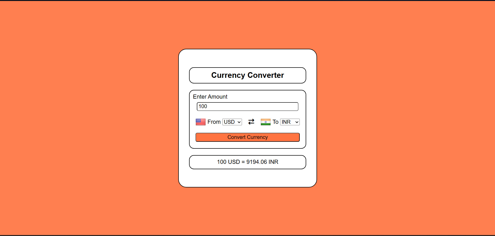

# Currency Converter 🌍

A responsive, real-time currency converter built with **Vanilla JavaScript**, **HTML5**, and **CSS3**. This project fetches live exchange rates from an external API to provide accurate conversions for over 150 currencies.

## ✨ Features
- **Real-time Rates:** Fetches the latest data using the Fetch API.
- **Dynamic Flags:** Automatically updates country flags based on the selected currency.
- **Input Validation:** Prevents negative values and handles empty inputs gracefully.
- **Fully Responsive:** Styled with CSS to work across different screen sizes.

## 🚀 Demo
[Add your GitHub Pages link here once deployed]

## 🛠️ Tech Stack
- **Frontend:** HTML, CSS, JavaScript
- **API:** [Fawaz Ahmed's Currency API](https://github.com/fawazahmed0/currency-api)
- **Icons:** Font Awesome, FlagsAPI

## 📖 How to Use
1. Enter the amount you wish to convert.
2. Select the "From" currency and the "To" currency from the dropdowns.
3. Click the **Convert Currency** button to see the result.

## 📸 Preview

